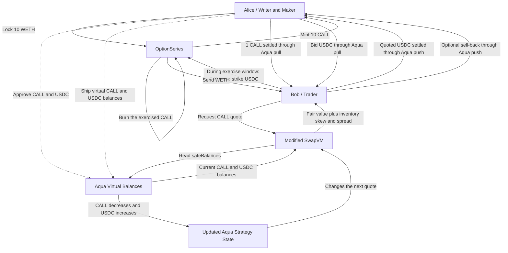

# AquaVol

AquaVol is a spec-driven project being developed during ETHGlobal Tokyo 2026.

## Status

This repository currently contains the project baseline, prompt record, and
draft product specifications. No application or smart-contract code has been
implemented yet.

The project is in **position discovery**. Implementation begins only after the
position lifecycle, mathematical inputs, settlement path, and demo evidence
are approved in the foundation specification.

## Intended stack

- Frontend: React, TypeScript, and Vite
- Backend: Node.js and TypeScript
- Smart contracts: Solidity and Foundry
- Network: Base Sepolia
- Reference mathematics: Python Black-Scholes model and deterministic test
  vectors

## How it works

`OptionSeries` holds collateral and enforces exercise. Aqua tracks the maker's
virtual liquidity and settles token transfers. SwapVM reads the current Aqua
balances and calculates the executable price. The solid maker/trader arrows
show economic token movement authorized and accounted for through Aqua; Aqua
does not custody the strategy inventory when it is shipped.

## Development approach

The project follows a spec-driven workflow. Specifications, prompts, planning
artifacts, provenance, and AI assistance will be committed alongside the
implementation so that the development process remains reviewable.

Current working documents:

- [Foundation specification](specs/00-foundation.md)
- [Product specification](specs/01-product.md)
- [Option lifecycle](specs/02-option-lifecycle.md)
- [Pricing model](specs/03-pricing-model.md)
- [Aqua and SwapVM integration](specs/04-aqua-swapvm-integration.md)
- [Security invariants](specs/05-security-invariants.md)
- [Demo acceptance](specs/06-demo-acceptance.md)
- [Engineering log](docs/ENGINEERING_LOG.md)
- [Dependency register](docs/DEPENDENCY_REGISTER.md)
- [Repository policy](docs/REPOSITORY_POLICY.md)

## Event references

- [ETHGlobal Tokyo 2026](https://ethglobal.com/events/tokyo2026)
- [ETHGlobal rules](https://ethglobal.com/events/tokyo2026/info/details#important-rules)
- [Event prize requirements](https://ethglobal.com/events/tokyo2026/prizes)
- [Aqua contracts](https://github.com/1inch/aqua)
- [SwapVM contracts](https://github.com/1inch/swap-vm)
- [Aqua TypeScript SDK](https://github.com/1inch/sdks/tree/master/typescript/aqua)
