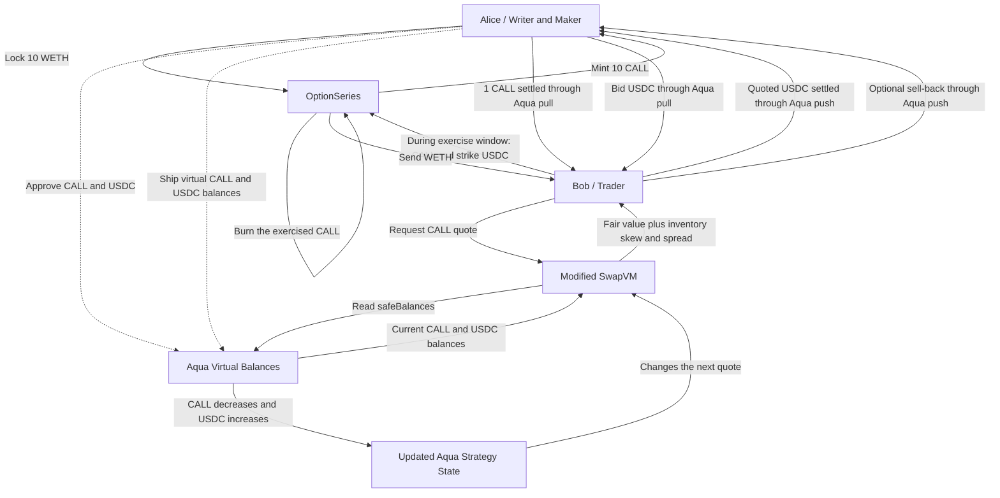

# AquaVol

AquaVol is a spec-driven project being developed during ETHGlobal Tokyo 2026.

## Status

This repository contains the project specifications and prompt record, an
independent Python mathematical reference, the collateralized option lifecycle,
and a pinned local Aqua/SwapVM integration harness. The unmodified protocol
baseline settles a tested CALL/USDC trade and reconciles real token transfers
with Aqua virtual balances.

The **custom SwapVM router, local Aqua settlement path, guarded Uniswap V3 TWAP
spot oracle, bounded volatility registry, fixed-point Black-Scholes libraries,
fair-value opcode, inventory-skew opcode, and dynamic Aqua repricing are
implemented and tested**. Base Sepolia canonical-pool verification, deployment
preflight tooling, and a pinned full-deployment fork rehearsal are available.
A partial Base Sepolia deployment now includes the demo asset, seeded Uniswap
V3 pool, exact-source Aqua, size-safe custom SwapVM router and pricing engine,
volatility registry, guarded TWAP oracle, immutable option series, and a live
fully collateralized Aqua strategy. A distinct trader has completed the public
0.01 CALL purchase with reconciled real and virtual balances. Source
verification, final submission checks, and the browser application remain
pending. No backend is required for the canonical demo.

## Intended stack

- Frontend: React, TypeScript, and Vite
- Backend: Node.js and TypeScript
- Smart contracts: Solidity and Foundry
- Network: Base Sepolia
- Reference mathematics: Python Black-Scholes model and deterministic test
  vectors

## How it works



`OptionSeries` holds collateral and enforces exercise. Aqua tracks the maker's
virtual liquidity and settles token transfers. SwapVM reads the current Aqua
balances and calculates the executable price. The solid maker/trader arrows
show economic token movement authorized and accounted for through Aqua; Aqua
does not custody the strategy inventory when it is shipped.

## Mathematical reference

The standard-library Python model provides independent Black-Scholes and
inventory-pricing vectors for later TypeScript and Solidity implementations.
For the canonical inputs—3,800 spot, 4,000 strike, seven days, and 64%
volatility—the fair call value is `60.294026671319` USDC. With the approved
first-trade inventory adjustment and spread, the initial one-CALL ask is
`61.505936607413` USDC before token-unit rounding.

Run the reference tests from the repository root:

```bash
PYTHONPATH=python python3 -m unittest discover -s python/tests -v
```

See the [Python reference](python/README.md) and
[version-one vectors](test/vectors/black_scholes-v1.json).

## OptionSeries contracts

The Foundry project implements one fully collateralized European covered-call
series. It locks WETH one-to-one with CALL, supports upward-rounded fractional
USDC strike payments during the exercise window, and permits one final writer
redemption after that window closes.

Run the contract checks:

```bash
cd contracts
forge fmt --check
forge build
forge test
```

These contracts are hackathon software and have not been audited. See the
[contract notes](contracts/README.md) for the current scope and boundaries.
The [baseline swap evidence](docs/BASELINE_SWAP_EVIDENCE.md) records the local
unmodified Aqua/SwapVM settlement proof.
The [custom-router settlement evidence](docs/CUSTOM_ROUTER_SETTLEMENT_EVIDENCE.md)
records the corresponding proof through the AquaVol opcode layer.
The [Base Sepolia Uniswap evidence](docs/BASE_SEPOLIA_UNISWAP_EVIDENCE.md)
documents the opt-in canonical-pool observation check and its limitations.
The [Base Sepolia deployment record](docs/BASE_SEPOLIA_DEPLOYMENT.md) tracks the
current public addresses, transactions, verification checks, and pending work.

## Uniswap integration

AquaVol creates a project-seeded WETH/avUSD pool through the official Base
Sepolia Uniswap V3 position manager and uses the pool exclusively as the
guarded spot input to option pricing. The adapter verifies factory identity,
token order, fee tier, a complete 30-minute observation window, latest
observation freshness, current and harmonic liquidity, spot/TWAP deviation,
and price bounds on every read.

Reviewers can verify the integration directly in:

- [`UniswapV3TwapOracle.sol`](contracts/src/oracles/uniswap/UniswapV3TwapOracle.sol) — guarded onchain TWAP reads
- [`UniswapV3OracleMath.sol`](contracts/src/oracles/uniswap/UniswapV3OracleMath.sol) — cumulative-tick and normalized quote calculation
- [`BootstrapUniswapV3Pool.s.sol`](contracts/script/BootstrapUniswapV3Pool.s.sol) — official factory and position-manager usage
- [`WriteTwapObservation.s.sol`](contracts/script/WriteTwapObservation.s.sol) — full-window check and SwapRouter02 observation write
- [`BaseSepoliaDeploymentRehearsal.t.sol`](contracts/test/fork/BaseSepoliaDeploymentRehearsal.t.sol) — end-to-end fork proof
- [`FEEDBACK.md`](FEEDBACK.md) — required Uniswap developer feedback

Public addresses, pool parameters, and transaction hashes are listed in the
[Base Sepolia deployment record](docs/BASE_SEPOLIA_DEPLOYMENT.md). The pool uses
the project-issued `avUSD` demo token and must not be interpreted as a canonical
USDC or production oracle market.

## Development approach

The project follows a spec-driven workflow. Specifications, prompts, planning
artifacts, provenance, and AI assistance will be committed alongside the
implementation so that the development process remains reviewable.

Current working documents:

- [Foundation specification](specs/00-foundation.md)
- [Product specification](specs/01-product.md)
- [Option lifecycle](specs/02-option-lifecycle.md)
- [Pricing model](specs/03-pricing-model.md)
- [Aqua and SwapVM integration](specs/04-aqua-swapvm-integration.md)
- [Security invariants](specs/05-security-invariants.md)
- [Demo acceptance](specs/06-demo-acceptance.md)
- [Custom SwapVM router](specs/07-custom-swapvm-router.md)
- [Uniswap V3 TWAP oracle](specs/08-uniswap-v3-twap-oracle.md)
- [Volatility registry and fair value](specs/09-volatility-and-fair-value.md)
- [Inventory-aware pricing](specs/10-inventory-aware-pricing.md)
- [Base Sepolia deployment](specs/11-base-sepolia-deployment.md)
- [Engineering log](docs/ENGINEERING_LOG.md)
- [Dependency register](docs/DEPENDENCY_REGISTER.md)
- [Protocol provenance](docs/PROTOCOL_PROVENANCE.md)
- [Uniswap provenance](docs/UNISWAP_PROVENANCE.md)
- [PRBMath provenance](docs/PRB_MATH_PROVENANCE.md)
- [Base Sepolia deployment plan](docs/BASE_SEPOLIA_DEPLOYMENT_PLAN.md)
- [Base Sepolia fork rehearsal](docs/BASE_SEPOLIA_REHEARSAL.md)
- [Repository policy](docs/REPOSITORY_POLICY.md)

## Event references

- [ETHGlobal Tokyo 2026](https://ethglobal.com/events/tokyo2026)
- [ETHGlobal rules](https://ethglobal.com/events/tokyo2026/info/details#important-rules)
- [Event prize requirements](https://ethglobal.com/events/tokyo2026/prizes)
- [Aqua contracts](https://github.com/1inch/aqua)
- [SwapVM contracts](https://github.com/1inch/swap-vm)
- [Aqua TypeScript SDK](https://github.com/1inch/sdks/tree/master/typescript/aqua)

## Protocol attribution

Powered by Aqua — © Degensoft Ltd 2025.

Powered by SwapVM — © Degensoft Ltd 2025.

The pinned Aqua and SwapVM sources retain their upstream licenses and notices.
Any AquaVol component that modifies or extends SwapVM is published under
`LicenseRef-Degensoft-SwapVM-1.1`; independent AquaVol components keep their
own stated licenses. See [protocol provenance](docs/PROTOCOL_PROVENANCE.md).

## Testnet trust model

The planned Base Sepolia demo uses one dedicated, testnet-only operator wallet
as deployer, volatility updater, option writer, and Aqua maker. This consolidated
role can influence quotes and is a disclosed hackathon simplification, not a
production security model. A distinct browser-connected trader wallet provides
the independent counterparty for public transfer evidence. Neither identity
should hold mainnet assets, and no private key belongs in this repository.
